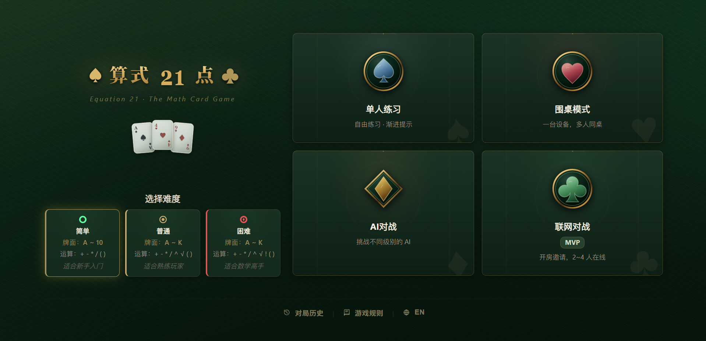

# Equation 21 — 算式21点

一款用扑克牌数字凑出 21 的网页卡牌游戏。玩家需要组合运算符与括号，写出结果等于 21 的算式。
内置表达式解析器、AI 求解器、PWA 离线支持与联网房间。

* AA browser-based math card game where players use card values and operators to build equations that equal 21.*
*Includes a custom expression engine, AI solver, PWA support, and online rooms.*

**[在线试玩 / Play](https://eq21game.com)**

| 单人练习 | 围桌模式 | AI 对战 | 联网对战 |
|:---:|:---:|:---:|:---:|
| 自由练习 · 渐进提示 | 2~4 人同设备 | 三级难度 AI | 开房邀请 · 在线对决 |

  

## 技术栈

| 层 | 技术 |
|----|------|
| 前端 | HTML + CSS + JS（零框架，零构建） |
| AI | Web Worker + 自研表达式解析器 + DP 搜索 |
| 联网 | Cloudflare Workers + Durable Objects + WebSocket |
| 离线 | PWA + Service Worker |
| 测试 | 表达式 / Fuzz / 静态 / DOM / Worker / 联网协议 |

## 快速开始

双击 `index.html` 即可游玩。联网模式开发需 Node.js + Wrangler，详见 [项目结构](docs/STRUCTURE.md)。

## 文档

| 文档 | 说明 |
|------|------|
| [游戏规则](docs/GAME_RULES.md) | 完整玩法说明 |
| [更新日志](CHANGELOG.md) | 版本变更记录 |
| [项目结构](docs/STRUCTURE.md) | 文件职责 & 修改指引 |
| [架构分析](docs/ARCHITECTURE.md) | 设计决策 & 重构方向 |

## 许可

[MIT License](LICENSE)
